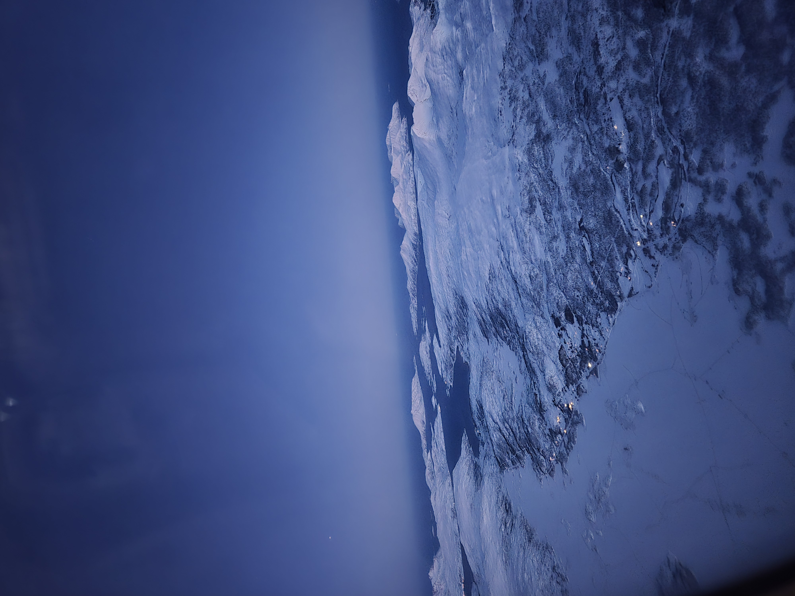
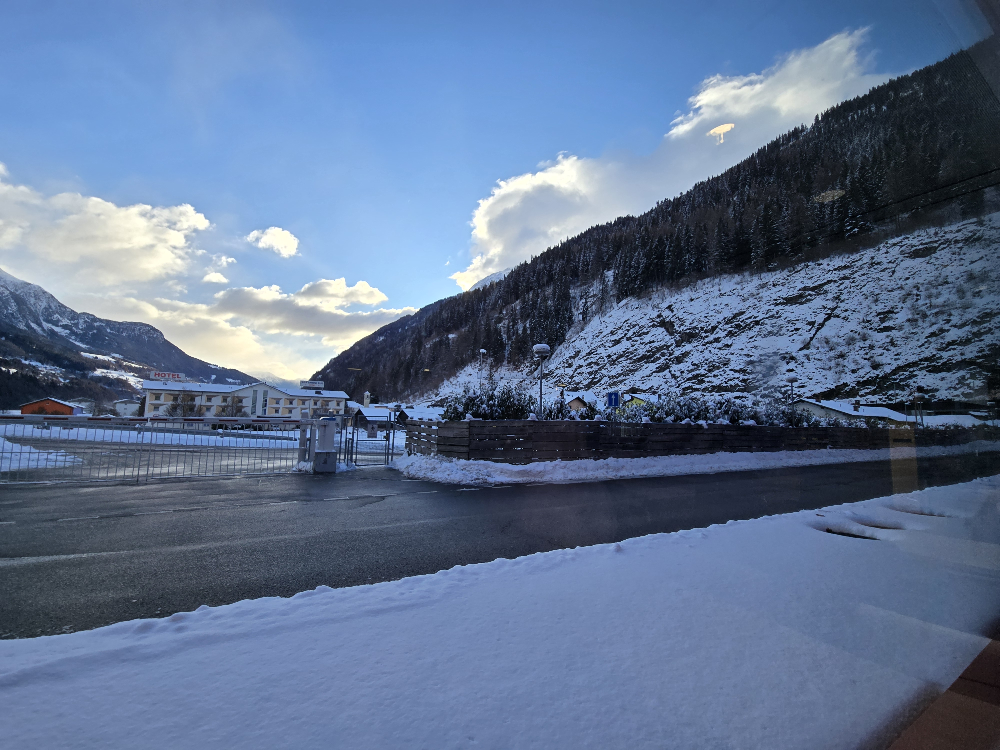

Chuyến đi xuyên lục địa này bắt đầu bằng những đêm "ngủ bụi" vật vờ chờ nối chuyến ở sân bay. Lúc đó, hành trang lớn nhất của mình có lẽ là sự háo hức xen lẫn chút căng thẳng của lần đầu tiên đặt chân đến lục địa già, đi đến một nơi xa lạ, và kết quả là trễ chuyến bay, rồi delay đủ kiểu :d.
<!-- truncate -->

## 1. Mình đã đi đâu

**Pháp – Chạm ngõ Châu Âu và cơn mưa tuyết đầu đời:** Paris là điểm đến đầu tiên. Dù đã quen thuộc với nước Pháp qua những bộ phim như vô số màn ảnh nhỏ, nhưng cảm giác thực sự bước đi giữa trời Tây, hít thở bầu không khí lạnh ngắt lại hoàn toàn khác biệt. Lúc đó trời đổ tuyết. Là một người con sinh ra và lớn lên ở miền Nam, đây là lần đầu tiên trong đời mình được chạm vào tuyết. Cảm nhận chân thật nhất lúc đó? Mình chỉ thấy thế giới này thật kỳ diệu. Tuyết mịn màng và tơi xốp, làm mình rất kinh ngạc vì nó giống hệt... những lớp nước đá xay nhuyễn người ta hay dùng để ướp tôm ở dưới quê. Sau này, khi có thời gian nán lại Paris lâu hơn, mình mới thực sự được chìm đắm trong sự cổ kính của Tháp Eiffel và Khải Hoàn Môn nơi mà Tom Cruise đã lạng lách đánh võng trong bộ (**Mission: Impossible - Fallout 2018)**.

Ảnh 1: Tháp Eiffel vào ban đêm

**Na Uy – Cái lạnh cắt da và sự tĩnh lặng của Bắc Băng Dương:** Đường đến hội nghị tại Tromsø quả thực là một thử thách. Mình phải bay vòng qua Helsinki (Phần Lan) rồi mới hạ cánh xuống vùng cực. Càng đi lên phía Bắc, nhiệt độ càng giảm sâu. Đó là một cái lạnh buốt giá, xuyên thấu qua từng lớp áo mà mình chưa từng trải qua trong đời. Nhưng khoảnh khắc nhìn ra ngoài cửa sổ máy bay lúc hạ cánh, mọi mệt mỏi đều tan biến. Thứ khiến mình choáng ngợp và ấn tượng nhất chính là vẻ đẹp tĩnh lặng, kỳ vĩ của biển Bắc Băng Dương.

Ảnh 2: Biển Bắc Băng Dương nhìn từ trên cao

**Thụy Sĩ & Ý – Ngã ba biên giới, rặng Alps vĩ đại và Venice bồng bềnh:** Rời Pháp, chuyến tàu đưa mình ghé qua Basel. Có một trải nghiệm khá buồn cười là khi mở bản đồ số lên kiểm tra định vị, mình ngớ người nhận ra thành phố này nằm vắt ngang qua 3 quốc gia. Hàng loạt câu hỏi nảy lên trong đầu: *Luật pháp ở đây hoạt động ra sao? Giao thông vận hành thế nào? Quy hoạch đô thị phải đồng bộ ra sao?* Quả thực, thế giới luôn có những vùng đất với những đặc tính kỳ lạ nằm ngoài sức tưởng tượng của chúng ta.

Ảnh 3: trạm dừng chân, dãy Alps ở Thụy Sĩ

Từ Thụy Sĩ xuôi về Milan (Ý), hành trình đưa mình xuyên qua dãy Alps – dãy núi cao nhất Châu Âu trải dài 1.200 km. Ngồi trên tàu, thu vào tầm mắt là những dốc núi tuyết trắng xóa hùng vĩ xen lẫn những ngôi làng nhỏ xinh đẹp bình yên. Cảnh tượng đó thực sự đẹp như một bức tranh bưu thiếp ngoài đời thực.

Và dĩ nhiên, bước chân trên đất Ý của mình không thể trọn vẹn nếu thiếu Venice – thành phố nổi độc nhất vô nhị. Nếu dãy Alps vĩ đại khiến mình choáng ngợp bởi sự sừng sững của núi non, thì Venice lại đánh gục mình bằng vẻ đẹp lãng mạn, êm đềm. Bước đi giữa những con ngõ nhỏ chằng chịt như mê cung, lọt thỏm giữa không gian hoàn toàn vắng bóng động cơ xe cộ, chỉ có tiếng sóng vỗ nhẹ vào những mảng tường rêu phong và tiếng mái chèo khỏa nước. Tại đây, mình có cảm giác như thời gian dường như ngưng đọng, đưa mình bước vào một chiều không gian hoàn toàn khác.

## 2. Sự khiêm nhường trước thiên nhiên và niềm tin vào ý chí con người

Dù là khoảnh khắc đi qua những đường hầm tối om kéo dài xuyên qua dãy Alps hùng vĩ, hay khi ngắm nhìn biển Bắc Băng Dương bao la từ trên cao, mình luôn cảm thấy bản thân thật nhỏ bé trước thiên nhiên. Thế nhưng, cảm giác “nhỏ bé” đó không hề làm mình yếu đi.

Ngược lại, nó cho mình thấy một sự thật: thế giới này vô cùng rộng lớn, nhưng ý chí của con người cũng vĩ đại không kém. Bình thường, công việc của chúng ta xoay quanh những dòng code, trước màn hình máy tính. Nhưng khi bước ra thế giới thực, nhìn cách con người từ hàng trăm năm trước đục xuyên qua cả một dãy núi đá lạnh lẽo để làm đường sắt, hay việc dựng lên khối thép khổng lồ giữa lòng Paris, ta mới thấy khả năng của con người là không có giới hạn.

Chính sự choáng ngợp trước thiên nhiên và niềm khâm phục trước sức mạnh lao động của con người đã khiến những áp lực "cơm áo gạo tiền" hay cái tôi cá nhân bỗng trở nên thật tầm thường. Trải nghiệm này dạy mình rằng: chúng ta tuy chỉ là một phần nhỏ bé của thế giới, nhưng mỗi cá nhân đều mang trong mình sức mạnh để hướng đến những điều vĩ đại cho riêng mình, dù trong bất kỳ lĩnh vực nào.

## 3. Du lịch là "khắc tinh" của định kiến

> *"Du lịch là kẻ thù của định kiến, mù quáng và thiển cận." – Mark Twain*
> 

Khi ngồi ở nhà và nhìn thế giới qua lăng kính của truyền thông hay mạng xã hội, chúng ta rất dễ phán xét mọi thứ. Nhưng khi bạn thực sự đặt chân đến một vùng đất mới, đi bộ trên những con phố của họ, quan sát cách người bản địa sinh hoạt, mọi rào cản vô hình sẽ tan biến.

Bạn sẽ nhận ra không có một chuẩn mực sống nào là duy nhất. Ở Tromsø, giữa thời tiết khắc nghiệt đến mức thấu xương, mình cứ tự hỏi: *Tại sao con người lại chọn sống và lập nghiệp ở đây? Tại sao tổ tiên của những dân tộc này không di cư về phương Nam ấm áp hơn mà lại kiên cường bám trụ lại vùng đất này?* Chứng kiến cách họ sinh tồn, xây dựng cộng đồng và hạnh phúc theo cách hoàn toàn khác mình khiến trái tim mình trở nên cởi mở và bao dung hơn. Đó là bài học về sự thấu cảm sắc bén nhất.

Và khi tầm nhìn được mở rộng, bạn sẽ thấy những biến động lớn như cuộc chiến ở Ukraine hay Trung Đông mới thực sự là những vấn đề cốt lõi mà nhân loại đang phải đối mặt và giải quyết, chứ không phải những drama vụn vặt hàng ngày trên mạng.

## 4. Trưởng thành bắt đầu ở nơi "Vùng an toàn" kết thúc

Ở nhà, bạn biết rõ quán cà phê nào ngon, đoạn đường nào hay tắc, gặp khó khăn thì gọi cho ai. Mọi thứ được lập trình sẵn và cực kỳ an toàn. Nhưng xách balo lên đi du lịch một mình là tự ném mình vào những điều vô định:

- Là khi bạn lạc đường ở ngõ hẻm Rome giữa lúc điện thoại sập nguồn, mất hết định vị.
- Là khi phải vận dụng hết mọi loại ngôn ngữ cơ thể, khoa chân múa tay để gọi món vì người bán không hiểu tiếng Anh.
- Là khi chuyến bay bị delay, lịch trình đảo lộn và bạn phải co ro ngủ tạm ở hàng ghế sân bay lạnh lẽo.

Quả thật, đó là những lúc "lên bờ xuống ruộng", nhưng lại là lúc mình học được nhiều nhất. Chính trong những khoảnh khắc buộc phải tự xoay sở ấy, bản lĩnh được hình thành. Bạn sẽ ngạc nhiên khi nhận ra kỹ năng sinh tồn và sự tháo vát của mình mạnh mẽ hơn bản thân tưởng tượng rất nhiều. Giống như câu nói: *"Con thuyền neo đậu ở bến cảng thì rất an toàn, nhưng đó không phải là mục đích người ta đóng thuyền."*

## 5. Đi thật xa để trân trọng nơi trở về

Trải qua đủ "7749 kiếp nạn" trên đường, những đêm ngủ dằn xóc trên xe khách, hay chứng kiến những mảnh đời còn nhiều thiếu thốn ở những vùng đất xa xôi... bạn sẽ bỗng nhớ da diết chiếc giường êm ấm ở nhà.

Bạn nhớ những bữa ăn quen thuộc, nhớ sự tiện lợi của nơi mình sống, nhớ những người bạn thân. Chúng ta đi xa để mở rộng thế giới quan, lớn lên từ những va vấp, nhưng cũng là để nhận ra rằng: Hạnh phúc đôi khi không nằm ở chân trời góc bể nào đó quá xa xôi, mà nằm ngay ở những điều bình dị, thân thuộc mà trong nhịp sống hối hả, ta đã vô tình lãng quên.

---

## Lời kết

Theo quan niệm của mình cuộc sống là một cuốn sách lớn, và những người không bao giờ bước ra khỏi vùng an toàn chỉ mới đọc được một trang đầu tiên. Hãy đi khi đôi chân còn khỏe, khi nhiệt huyết còn đầy. Đi không phải để trốn chạy thực tại hay áp lực cuộc sống, mà để cuộc sống của chính mình không trôi qua một cách tẻ nhạt, lặp đi lặp lại hàng ngày để ngắm nhìn thế giới bao la ngoài kia cũng như mở rộng thế giới quan của mình và nhìn thấy thế giới xung quanh rộng lớn và kỳ diệu đến nhường nào..